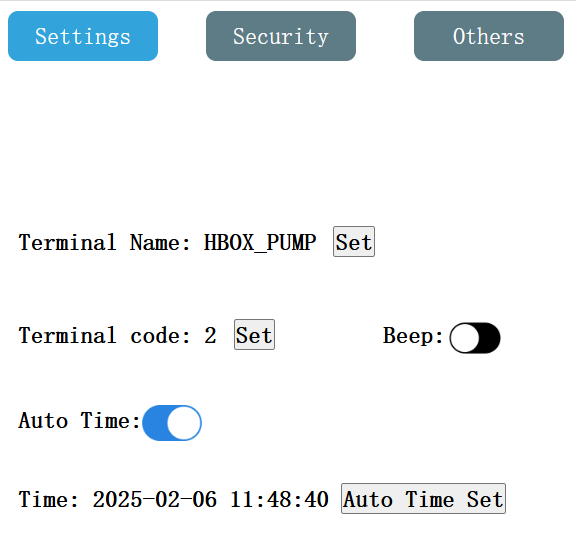

# HBOX Remote loop control Project Notes

## Introduction

This Guide has been written to aid in the setup of HNC HBOX equipment to write and read variables through the Cloud Data Center. The author is not an expert on these devices and has forged through the available documentation and help to achieve the task. I cannot comment on the security of IoT Cloud other than to say the communication and pairing of devices seems to have reasonable levels of security.

## The IoT Cloud

The IoT Cloud is a cloud based management tool that allows one to manage and monitor multiple devices remotely, either using the Web interface (limited functionality) or using the Device Manager Tool Upload/Download Projects, Change Settings etc.

## Configuration of HBOX Devices

1. Connect to Internet Network by whatever means
2. Create (or use existing) IoTBus Cloud User account
   - I would suggest that we establish a Company Wide Device Admin account that can Manage all Devices that the Company may be involved with. Associated Group Mailbox in O365. Users can be added to this mailbox for OTP code delivery when needed.
   - Devices are added through mobile app by scanning the QR Code related to each device and logging into the IOT Cloud.
     - It seems this step is necessary to create a AKey or a BKey which is required by cloud.
   - Inside Each project one can add additional users invited by email (user needs an IoTBus Cloud account already).
     - The additional users could be other Varispeed Staff or perhaps also Customer Engineers.
   - The related devices can be added to each project.

## MQTT Broker

An MQTT Broker is a server that acts as a data center where IoT devices can exchange messages. It is responsible for receiving all messages, filtering them, deciding who is interested in each message, and then sending the message to these subscribed clients.

The IoT Cloud service does have an MQTT styled broker built into it for use with IOT Cloud devices, though it does require a different configuration to a full MQTT server. At the time of authoring, this does some to do the job but
the documentation is not clear as to whether there are any limitations to the service. Other options to use MQTT as an alternative are given below, however
I have not worked through the process of using MQTT instead of Cloud Data Center. The Help in HTC Designer has further information with regard to the differences. If logging/reporting of historical data is required one would require an external database to store such data.

A number of other options exist if an external MQTT broker would be desired:

- MQTT Broker in End User Environment

  - Customer would need to provide a server (or Varispeed could supply one for a price) on which an MQTT Broker Could be installed.
  - This does not necessarily need to be an expensive device or high performance unless we also want extended logs to be kept or meany measures to be stored or communicated.
  - Communication to this MQTT server would have to be managed by Customer IT department or provider.
  - They would have to be responsible for ensuring security and patches are installed.

- MQTT Broker in Varispeed environment

  - Varispeed would need a server setting up and the MQTT Port DNAT'd in to supply MQTT service for Customer devices.
    - Varispeed IT would be responsible for managing security and patches.
    - There would be a cost incurred as a result - how we would measure that cost for each customer is difficult to guess, also scalability if many customers make use of this service could become and issue.

- Third Party MQTT Service Provider
  - There are many such out there e.g.:
    - HiveMQ Cloud
    - EMQX Cloud
    - AWS IoT Core
    - IBM Watson IoT Platform
    - Google Cloud IoT Core
  - Some provide free trials or accounts with limited free transactions/topics

For reasons related to the difficulties of maintaining a customers or our own infrastructure especially when it comes to security and scalability concerns I would recommend we look to use one of the existing cloud providers or the customer can choose one, MQTT is a standardized protocol and all the required features are built into the HNC devices to connect to an MQTT broker publish and subscribe to the data topics. This is all that would be needed.

## HTCloud Designer Dam Demo Project Walkthrough

The demo project consist of 2 HBOX devices one at the dam and on at the pump house. The basic premise being that when the dam level drops below 80% it will request the pump to start. At the pump side the device will poll the cloud variable and when it has a request to pump it will turn on the pump, providing the pump override switch is not in stop mode.

### Dam Side Project Configuration

1. Create the project as usual for the device

2. Configure any internal variables that are needed
   1. Ensure any "Signals" you want to send to other device are also set up.
  

1. Configure the Data Reporting Server
   1. Click on Data Reporting Server
   2. Click on Add Server
   3. Change Server to "Cloud Data Center"

1. Configure the data Group and Variables to publish in Cloud
   1. Click On Data Group
   2. Click Add data group
   3. Configure Data Group Parameters
   4. Change the Channel Count to the number of Vars required
   5. Click Apply
   6. Choose the Internal Vars to publish
   7. Change the Identifiers and Titles
      - These Identifiers and Titles will be used on Pump Side Project Cloud
      Data Device  to retrieve the Cloud Values.
   8. Click OK to save

1. Create the event & task to request set pump turn on request when level reaches
minimum and to turn off when level reaches maximum.

1. For this Demo I also created Events and Tasks that Initialize the Dam Level
and decrease/increase the Dam Level. For A live project these Variables
would be set by whatever measuring equipment is used in the field.
(You can look at these in the project file if you want but not normally needed)

1. Configure the retrieval of Data from the Pump side Box, this is done by
adding a Cloud Data Center Device. Note this is not strictly needed for the
project but it does help to be able to see on both sides what is going on.
Also for the purposes of this demo it retrieves the pump speed used to determine
if the pump is actually pumping which affects the loop decreasing/increasing level.
   1. Right Click on CloudDataCenter and Click Add Device.
   
   2. Change device name if desired and click "Set device Variables".
   
   3. Configure the device Variables.
      1. If you need to get here later double click the Cloud Device.
      2. Set the Group name, Group ID (This should be the same as the ID used
      in the Data Group in step 4. above)
           - Add the Pump Terminal Name and Code (Same as Settings on Pump
           Device Settings)
           - Add and Configure the Channels/Id's To retrieve, the same
           Channels and Id's will be used to Configure the Data Group on the Pump
           side Project.
   
   3. Note the Terminal settings below are from the PUMP Side box since this
   is the one from which we want to get data.
   

8. Now you can build the display and Bind the controls to the respective Internal
and external variables as required. Most of this will be obvious but see project
for more information.

### Pump Side Project Configuration
Most of the steps are similar to the Dam Side project.

1. Create the project as usual for the device

2. Configure any internal variables that are needed
   1. Ensure any "Signals" you want to send to other device are also set up.
  

1. Configure the Data Reporting Server
   1. Click on Data Reporting Server
   2. Click on Add Server
   3. Change Server to "Cloud Data Center"

1. Configure the data Group and Variables to publish in Cloud
   1. Click On Data Group
   2. Click Add data group
   3. Configure Data Group Parameters
   4. Change the Channel Count to the number of Vars required
   5. Click Apply
   6. Choose the Internal Vars to publish
   7. Change the Identifiers and Titles
      - These Identifiers and Titles will be used on Pump Side Project Cloud
      Data Device  to retrieve the Cloud Values.
   8. Click OK to save

1. Configure the retrieval of Data from the Dam side Box,
   1. Right Click on CloudDataCenter and Click Add Device.
   
   2. Change device name if desired and click "Set device Variables".
   
   3. Configure the device Variables.
      1. If you need to get here later double click the Cloud Device.
      2. Set the Group name, Group ID (This should be the same as the ID used
      in the Data Group in step 4. above)
           - Add the Pump Terminal Name and Code (Same as Settings on Pump
           Device Settings)
           - Add and Configure the Channels/Id's To retrieve, the same
           Channels and Id's will be used to Configure the Data Group on the Pump
           side Project.
   
   3. Note the Terminal settings below are from the DAM Side box since this
   is the one from which we want to get data.
   

2. Create the event & task to request set pump turn on request when level reaches
minimum and to turn off when level reaches maximum.
Note the Variable here is the External Pump On Required Variable

1. For this Demo I also created Events and Tasks that Initialize the set the speed
 of the motor when it is on. I also added an "Emergency" Stop Button adding to the
 logic of whether the motor will run.
(You can look at these in the project file if you want but not normally needed)

1. Now you can build the display and Bind the controls to the respective Internal
and external variables as required. Most of this will be obvious but see project
for more information.

### Cloud Settings
1. Adopt the devices into the IOT Cloud Environment
2. Create a Group to make it easier to find the devices and add the devices
to the group.
3. Under "Data Center" Create a New Project and add both devices to the Project.
4. Make sure "Remote" and "Inject App" are both turned on in the Project Settings.

### Final steps
Now all that remains is to download the projects into the devices and they should
be up and running.

### Epilogue
I trust this information has been helpful, there may be errors and key omissions
in this document but the projects are working and any corrections should be
obtainable from those. Also most of this information was gleaned from the Help
in the HTC Designer.